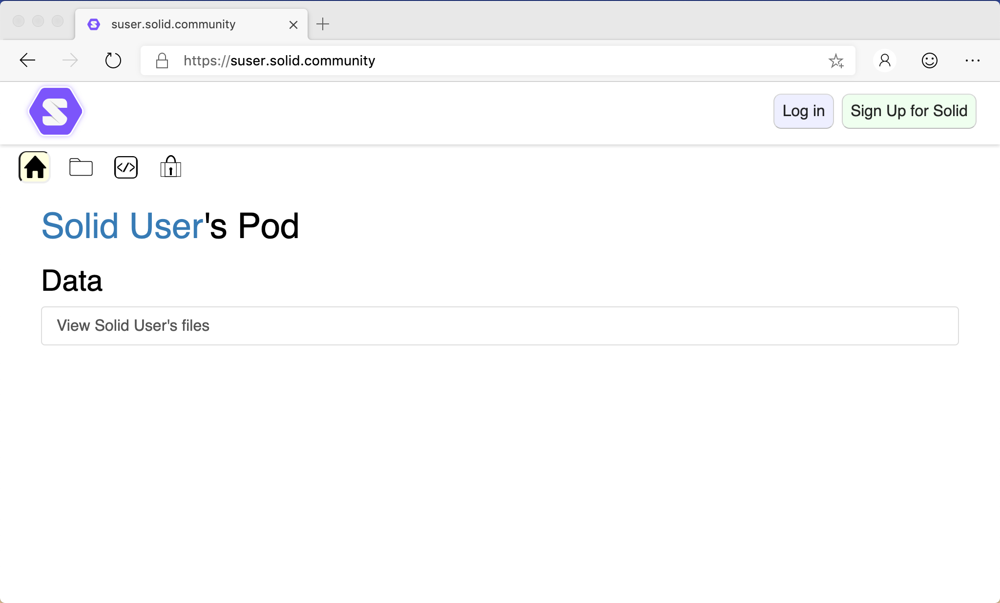
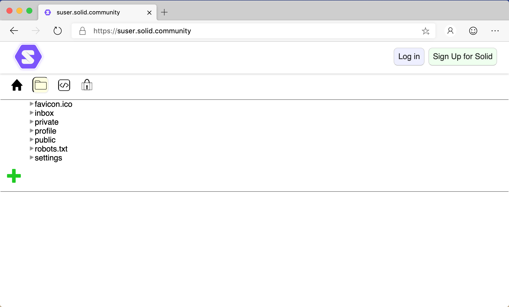
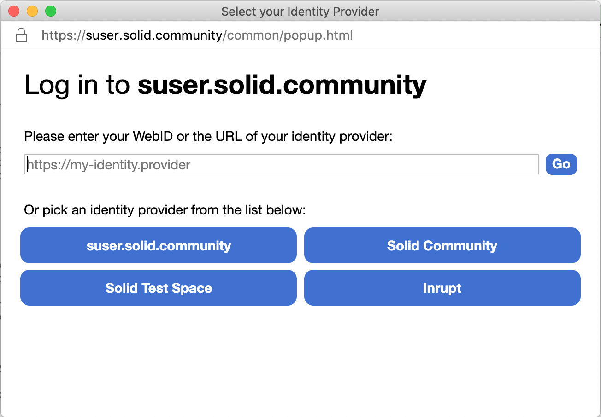
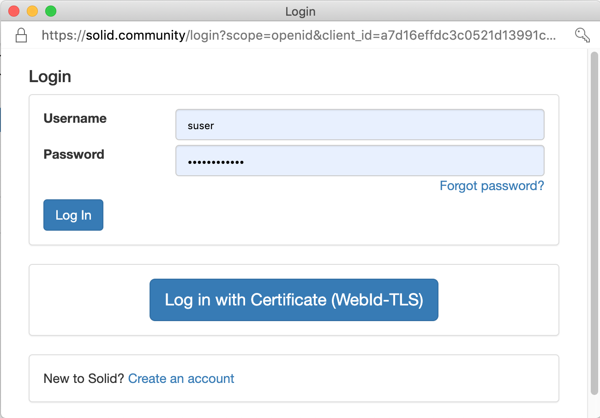
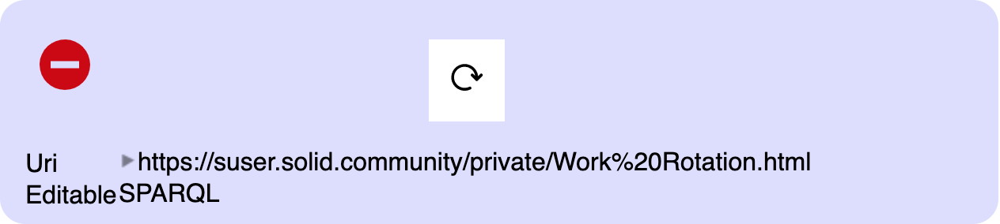
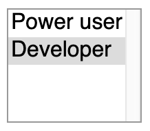
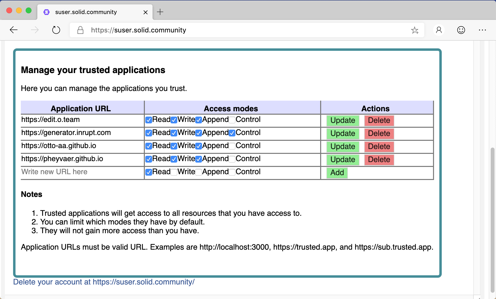

# Data Browser User Guide
The Data Browser is intended to be extremely flexible and provide all the basic functionality to allow people to easily manage data on Solid, be that social core with contact management and collaborate with your friends, or the more complex use cases, such as a researcher organizing their data and research on a variety of data sources.

The Data Browser is your de-facto default interface to Solid, enabling you to create, share and collaborate on data stored within Solid Pods with your friends and contacts through social networks and applications. Using the Data Browser, you can coordinate all of your data in an interface that can be configured and extended to support all of your needs on Solid.

## Accessing
To access the data stored in a Solid Pod via the Data Browser:

1. In a web browser, navigate to the root Uniform Resource Locator (URL) for the Pod.
2. You will see a view of the public data within the Pod:

    

You can see different views of the data by clicking the various View icons just below the header. For example, the Folder view:

_Tip: To return to the default View, click the Solid icon in the top-left corner of the Data Browser._

## Log In
To access your data, and data to which you have permission to access, you must log in:
1. Click the **Log in** button.
2. The "Select your Identity Provider" dialog is displayed:

    

3. Either enter you WebID into the textbox and click **Go** or pick your identity provider from the list.
4. The "Login" dialog is presented prompting you to enter your Username and Password:
    

    _Note: The actual form of the Login dialog depends upon the version of Solid server you are using._
5. After a successful login, you can [view](#Viewing-your-Data) of all of the data to which you have read permission within the Pod

## Navigation

## Creating new Data
You can create new folders and data within any Pod folder to which you have create access.

To create a new folder or data resource:
1. Navigate to the folder in which you want to create the new resource.
2. Click the green **+** icon for the folder.
3. Several icons are displayed showing the types of resource that can be created:
    * [Address Book](views/addressbook.md). List of contacts.
    * [Chat](views/chat.md). A short chat session.
    * [Dokieli](https://dokie.li/). Clientside editor for decentralised article publishing, annotations and social interactions.
    * Meeting. Setup a meeting.
    * Folder. Create a new named folder.
    * [Long Chat](/iews/longchat.md). A multi-day chat session.
    * Note Pad. A multi-user notepad.
    * Scheduled Event.
    * [Source](views/source.md). Text files, including Turtle.
4. Select the type of resource you want to create.
5. Enter the name of the new resource, and click the green **✓** (Continue) button.

_Tip: Dokieli documents must have a `.html` extension._

_Tip: Drag and drop a file onto the green **+**, and it will be uploaded to that directory._

## Viewing your Data
You can view the contents of any folders and/or data resources to which you have access. 

To view an existing folder or data resource:
1. Navigate to the folder containing the resource.
2. Open the resource by clicking the grey right arrow next to the resource.
3. Depending upon the type of resource selected, different view options can be displayed:
    * About.
    * Data.
    * Data as N3.
    * [Dokieli](https://dokie.li/). Clientside editor for decentralised article publishing, annotations and social interactions.
    * Folder.
    * Source.
    * RDF/XML.
    * Settings (Under the Hood).
    * Sharing. Display/update the sharing permissions for the resource.
    * Slideshow. Display a slideshow of the images contained within the folder.
    Additionally, if the selected resource is of a well-known type (e.g., Address Book, Chat, Dokieli, etc.), it will automatically be opened in that view.
4. Click the appropriate icon to view the resource in the desired manner.

_Tip: Each of the icons are toggle buttons. Click the icon again to close the view._

## Deleting existing Data
You can delete existing folder and data resources to which you have delete permission.

To delete an existing data resource:
1. Navigate to and open the resource you want to delete.
2. Click on the 'Settings' (Under the Hood) icon.
3. In the displayed panel, hover your mouse cursor to the left of the 'Refresh icon'. A red colored 'Remove' icon will become visible:
    

4. Click the 'Remove' icon.
5. Confirm the deletion by clicking the **Delete file** button.

_Tip: You need to refresh your web browser for the deletion to be visible in the Folder view._

## Preferences
You can configure your Data Browser user experience by setting your [roles(s)](#Role), [manage your trusted applications](#Manage-your-trusted-applications) or even [delete your Solid account](#Delete-your-Solid-account) via the Preferences view.

To display the Preferences view:
1. Either click the Solid logo or select **Preferences** from the dropdown menu in the top-right of the Data Browser.

2. Click the **Preferences** tab.

### Role
To streamline the options presented when viewing data, you can select your role:
* Normal User. Can view all standard social views.
* Developer. In addition to Normal User, view Data, N3, and RDF views of the data.
* Power User. In addition to Normal User, view additional Data Browser views such as Note Pad and Meetings.

Multiple roles can be selected.

To update:
1. Select you role(s) from the Roles listbox:

2. Click off the listbox.

_Tip: You need to refresh your web browser for the role changes to take affect._

### Manage your trusted applications

Before you can use third-party applications, you need to whitelist them (i.e., trust them to access data within your Pod) via the Trusted Application table:

#### Add
To whitelist a new third-party application, at the bottom of the table of trusted applications:
1. Enter the URL of the new application.
2. Select the permissions, or Access Modes, you want to give to the new application.
3. Click **Add**.

#### Update
To update the permissions for an existing trusted application, in the table of trusted applications:
1. Update the permssions for the application.
2. Click **Update**.

#### Delete
To revoke access for an existing trusted application, in the table of trusted applications:
1. Click **Delete** next to the application.
2. The application is immediately removed from the list of trusted applications.

### Delete your Solid account
If you no longer want your Solid Pod, you can delete your account.
1. Click the **Delete your account** link at the bottom of the Preferences page.
2. You are redirected to the Delete Account page for the Solid server.
3. Follow the displayed instructions to delete your account.
    _Note: The actual workflow for deleting your account depends upon the Solid server you are using:
    - [Node Solid Server (NSS)](https://github.com/solid/node-solid-server/blob/master/docs/how-to-delete-your-account.md)

_Tip: Once your account is deleted, all of the data is deleted and cannot be restored._

## Edit you profile
You can setup a public profile that will be visible to visitors to your Pod.

To edit your public profile:
1. Either:
    * Click the Solid logo, and then click the "Edit your profile" tab; or,
    * Select "Edit your profile" from the dropdown menu in the top-right corner of the Data Browser.
2. Enter:
    * Contact information about yourself that you want to make public. You can add multiple Addresses, Phones, and Emails.
    * Public contacts by dragging-and-dropping WebIDs of those contacts onto the target icon.
    * The background and highlight colors in which your public profile should be displayed.

## Your storage
