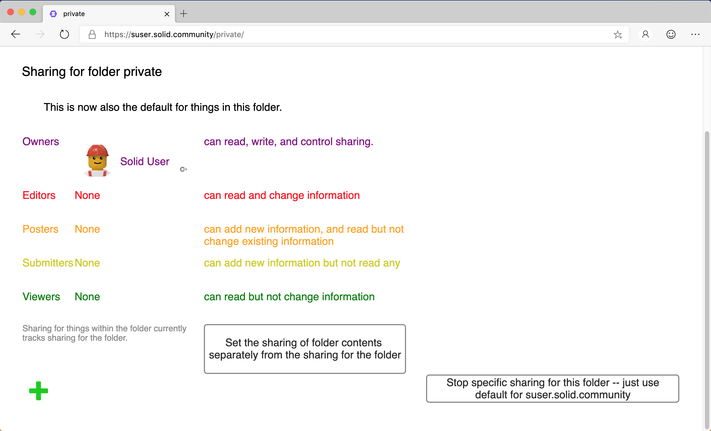

# Sharing View User Guide
Solid allows you to control who can access folders and data resources within your Pod, and what permission have - read, create, update, delete. 

## Access
To display the Sharing view for a folder or data resource:
1. Navigate to the resource.
2. Select the  Sharing view.
3. The Sharing settings for the selected resource are displayed:

_Tip: Clicking the  Goto This icon next to the user's Profile image/name will display the user's profile._

## Specific Sharing for a Resource
By default, resources within a folder inherit the permissions from the parent folder. 

To set specific sharing for the resource:
1. Click the **Set the sharing of folder contents separately from the sharing for the folder** button.
2. This causes the a set of sharing groups (Owners, Editors, Posters, Submitters, Viewers) for the specific resource to be displayed.

To reset the sharing for the resource back to the default:
1. Click the **Stop specific sharing for this folder/file** button.

## Custom Sharing
The sharing permissions for a given resource can be updated to provide access to specific users, groups, bots, authenticated agents, trusted applications, or even everyone.

### Add
To add a user/group/bot as Viewers:
1. Click the  Add icon.
2. Icons are displayed for each of the entities that can be given access to the resource:
    *  User.
    *  Group.
    *  Everyone.
    *  Authenticated Agent.
    *  Bot.
    *  Trusted Applications.
3. Select the entity type for which you want to provide access.
    * If a  User,  Group or  Bot is selected to be added:
        1. A text box is displayed allowing the URI for the entity to be entered.
        2. Enter the URI for the entity and click  Continue.
        3. The entered entity is added as a Viewer.
    * If  Everyone or  Authenticated Agent is selected:
        1. Everyone or Authenticated Agent is immediately added as a Viewer.
    * If  Trusted Applications is selected:
        1. A list of your trusted applications is displayed.
        2. Select the Trusted Applications you want to give access.
        3. The selected Trusted Applications are added as Viewers.
4. Once added, the sharing access of the entity can be [adjusted](#Adjust).

_Tip: To add a entity to a specific sharing group, drag-and-drop the URI for the entity onto the sharing group._

### Adjust
To move an entity between sharing groups:
1. Click-and-drag the entity between the sharing groups.

### Remove
To remove an entity from a sharing group:
1. Hover the mouse pointer over the  Goto This icon next to the user's Profile image/name.
2. A  Remove icon is displayed. 
3. Click the Remove icon to remove the sharing access for the entity.