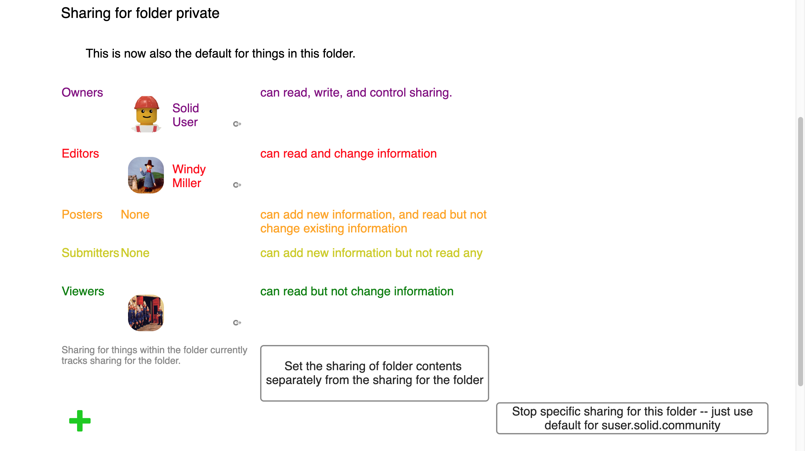

# Sharing View User Guide
Solid allows you to control who can access folders and data resources within your Pod, and what permission have - read, create, update, delete. 

## Access
To display the Sharing view for a folder or data resource:
1. Navigate to the resource.
2. Select the  Sharing view.
3. The Sharing settings for the selected resource are displayed:

## Specific Sharing
By default, resources within a folder inherit the permissions from the parent folder. 

To set specific sharing for the resource:
1. Click the **Set the sharing of folder contents separately from the sharing for the folder** button.
2. This causes the a set of sharing groups (Owners, Editors, Posters, Submitters, Viewers) for the specific resource to be displayed.

To reset the sharing for the resource back to the default:
1. Click the **Stop specific sharing for this folder/file** button.

## Custom Sharing
The sharing permissions for a given resource can be updated to provide access to specific users and/or groups.

To add a user to a sharing group (Owners, Editors, Posters, Submitters, Viewers):
1. Drag-and-drop the user's WebID on to the appropriate group.

To remove a user from a sharing group:
1. Hover the mouse pointer over the  Goto This icon next to the user's Profile image/name, and a  Remove icon is displayed. 
2. Click the icon to remove the sharing access for the user.

_Tip: Clicking the  Goto This icon next to the user's Profile image/name will display the user's profile._